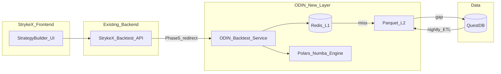
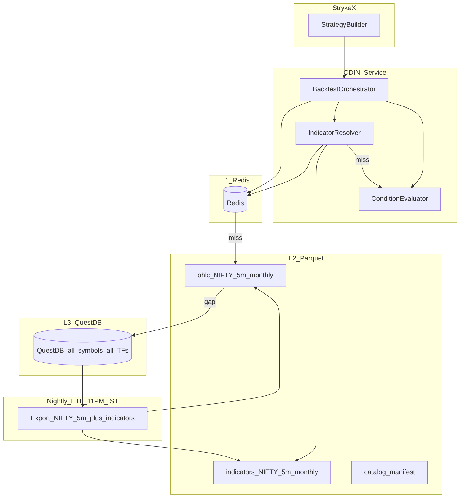
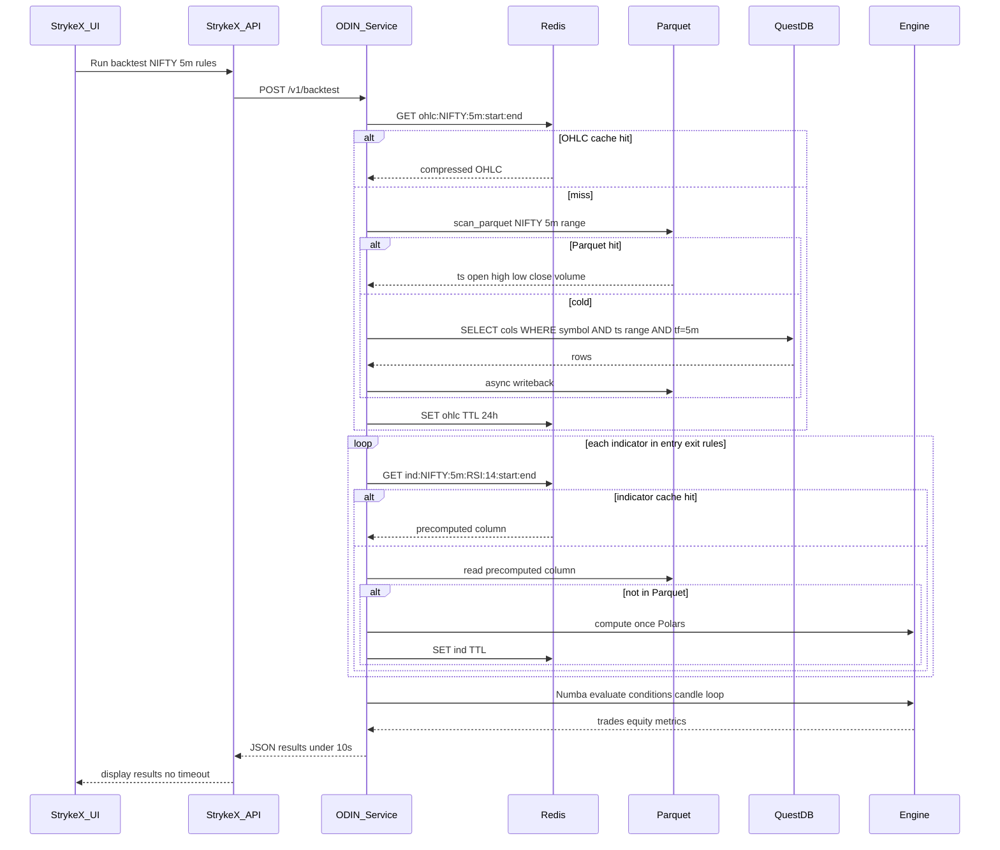

# Project ODIN — Implementation Plan (Revised)

**Project:** Optimized Data Infrastructure for NSE (Backtesting Engine)  
**Repo:** [d:\Projects\Optimized Data Infrastructure For Backtesting Engine](d:\Projects\Optimized Data Infrastructure For Backtesting Engine)  
**Product:** StrykeX Strategy Builder (`strykex.in/strategy-builder`)  
**Initial scope:** **NIFTY + 5-minute timeframe only** — all instruments/timeframes remain in QuestDB for later phases  
**Local dev seed:** [questdb-query-1781940224994.csv](questdb-query-1781940224994.csv) (1m sample for offline benchmarks only)

---

## Problem Statement (from production)

When a user completes the StrykeX builder flow and runs a backtest:

1. **Strategy Overview** — selects instrument (e.g. NIFTY), segment, intraday/positional
2. **Strategy Setup** — selects chart timeframe (e.g. **5 Minute**), spot/futures, price action
3. **Entry & Exit Criteria** — selects indicators (Current Close, RSI, EMA, etc.) and conditions
4. **Preview and Deployment** — clicks backtest

**What goes wrong today:**

- Backend fetches **too much OHLC** from QuestDB (often full 5-year history regardless of need)
- **Every indicator is recomputed** on every backtest run across all candles
- Execution is **single-threaded** Pandas/Python
- HTTP request **times out** before results return ("Oops timeout error")

ODIN sits **between StrykeX and QuestDB** as a dedicated backtest data + compute service. StrykeX UI stays unchanged; only the backtest API backend is redirected or augmented.

---

## StrykeX Backtest Request Model

Map the UI fields to ODIN's internal request:

| StrykeX UI field | ODIN parameter | Notes |
|------------------|----------------|-------|
| Instrument (NIFTY) | `symbol=NIFTY` | Phase 1 only |
| Chart Time Frame (5 Minute) | `timeframe=5m` | Phase 1 only |
| Chart Selection (Spot) | `series=spot` | Affects table/symbol key in QuestDB |
| Entry conditions | `entry_rules[]` | Indicator + operator + value |
| Exit conditions | `exit_rules[]` | Indicator/time/SL-target based |
| Date range (if exposed) | `start`, `end` | Default: last 1y; never unbounded 5y without explicit user choice |



---

## Target Architecture



**Why timeouts stop:** Most requests never hit QuestDB. OHLC + common indicators are served from Redis or Parquet in milliseconds. Full 5-year compute moves to nightly batch, not per-click.

---

## Live Request Flow (NIFTY 5m backtest)



---

## QuestDB Query Contract (immediate win — Phase 0)

Every ODIN query to QuestDB must follow this pattern. Reject unbounded queries at the API to prevent timeouts.

```sql
SELECT timestamp, open, high, low, close, volume
FROM ohlc_5m                    -- or your actual table name
WHERE symbol = 'NIFTY'
  AND timestamp >= '2024-01-01T00:00:00.000000Z'
  AND timestamp <  '2025-01-01T00:00:00.000000Z'
```

**Required DDL checks:**

- Table partitioned by `MONTH` or `DAY` on `timestamp`
- `symbol` and `timeframe` in `WHERE` clause (not filtered in Python)
- Never `SELECT *`
- Index/designated timestamp column aligned with StrykeX 5m candles

**Action item:** Document actual QuestDB table name, column names, and partition strategy from your production schema before Phase 1.

---

## Parquet Layout (NIFTY 5m only — Phase 1)

```
data/parquet/
  ohlc/
    NIFTY/
      5m/
        2021-01.parquet
        2021-02.parquet
        ...
        2026-06.parquet
  indicators/
    NIFTY/
      5m/
        2024-01.parquet    # merged or sidecar: rsi_14, ema_9, ema_20, atr_14, bb_upper, bb_lower, ...
  catalog.json             # { "NIFTY": { "5m": { "min_ts": "...", "max_ts": "...", "months": [...] } } }
```

Nightly ETL exports **only NIFTY 5m** from QuestDB initially. Other symbols/timeframes stay in QuestDB untouched until Phase 6.

---

## Indicator Strategy (Phase 3 — highest leverage for StrykeX)

StrykeX supports many indicators across entry/exit criteria. Two-tier approach:

**Tier A — Precompute nightly (standard params used 80% of the time):**

- Price fields: `open`, `high`, `low`, `close`, `volume` (already in OHLC)
- Moving averages: EMA 9, 20, 50, 200; SMA 20, 50
- Momentum: RSI 14, MACD (12, 26, 9), Stochastic (14, 3, 3)
- Volatility: ATR 14, Bollinger (20, 2)
- Others from your builder catalog — inventory needed from StrykeX team

**Tier B — Compute on demand + cache (custom params):**

- User picks RSI 21 instead of 14 → compute once with Polars, cache key `ind:NIFTY:5m:RSI:21:start:end`
- Subsequent backtests with same params hit Redis

**Registry file:** `packages/odin-indicators/registry.yaml` maps StrykeX indicator names → compute function + default params + precompute flag.

---

## Repository Structure

```
Optimized Data Infrastructure For Backtesting Engine/
├── docs/
│   ├── architecture.md
│   ├── strykex-integration.md    # API contract with existing backend
│   └── questdb-schema.md         # table names, partitions, sample queries
├── data/
│   ├── raw/questdb-query-*.csv   # offline dev only
│   └── parquet/                  # generated; gitignored
├── services/
│   ├── odin-api/                 # FastAPI: /v1/backtest endpoint for StrykeX
│   └── nightly-etl/              # QuestDB → Parquet → indicators (NIFTY 5m)
├── packages/
│   ├── odin-data/                # QuestDB, Parquet, Redis clients
│   ├── odin-indicators/          # registry + precompute + on-demand
│   └── odin-engine/              # condition evaluator + Numba kernel
├── infra/
│   └── docker-compose.yml        # Redis + ODIN API (QuestDB external)
├── benchmarks/
│   ├── baseline_strykex.py       # reproduce current slow path
│   └── odin_nifty_5m.py          # NIFTY 5m before/after
├── catalog/
└── pyproject.toml
```

**No new Strategy Builder UI.** StrykeX frontend is the UI. ODIN is backend-only.

---

## Phased Rollout

### Phase 0 — Baseline and QuestDB Fixes (Week 1)

**Goal:** Measure the timeout problem; get quick wins without new infra.

- Profile current StrykeX backtest for **NIFTY 5m** — time spent in: QuestDB fetch, indicator compute, condition loop, serialization
- Record p50/p95 and timeout threshold (likely 30–60s gateway limit)
- Apply QuestDB query contract (partition, column select, date bounds)
- Use CSV sample for local offline benchmark when QuestDB unavailable
- Document StrykeX backtest request/response JSON schema in `docs/strykex-integration.md`

**Exit criteria:** Baseline JSON with breakdown; QuestDB queries for NIFTY 5m return in under 2s for 1-year range.

---

### Phase 1 — Parquet Tier for NIFTY 5m (Week 2)

**Goal:** Analytical reads 10–30x faster than SQL for backtest data loads.

- Nightly job: export QuestDB `NIFTY` + `5m` → monthly Parquet files
- `odin-data.ParquetStore.read("NIFTY", "5m", start, end)` via `pl.scan_parquet`
- ODIN API reads Parquet first; QuestDB only on cache miss / gap
- Backfill all available NIFTY 5m history from QuestDB on first run

**Exit criteria:** 1-year NIFTY 5m OHLC load under 500ms from Parquet.

---

### Phase 2 — Redis Cache (Week 3)

**Goal:** Eliminate repeat work; fix "same strategy, second run" timeouts.

- Keys:
  - `ohlc:NIFTY:5m:{start}:{end}`
  - `ind:NIFTY:5m:{indicator}:{params_hash}:{start}:{end}`
- Compression: zstd on Arrow IPC blobs
- TTL: 24h; invalidate affected keys after nightly ETL
- Expose `/metrics`: cache_hit_rate, p95_latency_by_tier

**Exit criteria:** Identical NIFTY 5m backtest twice — second run under 500ms total.

---

### Phase 3 — Indicator Precompute (Week 4)

**Goal:** Address the main compute cost when users stack multiple indicators in entry/exit criteria.

- Inventory all StrykeX builder indicators (from product team)
- Precompute Tier A indicators into `data/parquet/indicators/NIFTY/5m/`
- `IndicatorResolver` in ODIN: check precomputed → Redis → compute on demand
- Align with UI concepts: "Current Close 5 Minute", RSI, EMA crosses, etc.

**Exit criteria:** Strategy with 3+ indicators completes under 5s (cold) / under 1s (warm).

---

### Phase 4 — Fast Execution Engine (Week 5)

**Goal:** Speed up condition evaluation loop (price action + indicator comparisons).

- Polars for vectorized prep; NumPy arrays passed to `@numba.njit` kernel
- Map StrykeX condition types: Equal, Greater Than, Crosses Above, etc.
- Support entry case blocks (Case 1, Case 2 OR logic from UI)
- Return same response shape StrykeX UI expects (trades, PnL, equity curve)

**Exit criteria:** Condition loop 10x+ faster than current Python loop.

---

### Phase 5 — StrykeX Integration (Week 6)

**Goal:** Production path — users stop seeing timeout errors.

- Option A (recommended): StrykeX backtest API calls ODIN internally (feature flag `USE_ODIN=true`)
- Option B: Parallel run — ODIN validates against old path until confidence is high
- Add async fallback for very long ranges: `POST /v1/backtest/async` → job ID → poll (only if needed after optimizations)
- Do **not** rely on increasing HTTP timeout as the primary fix

**Exit criteria:** NIFTY 5m backtest from StrykeX UI completes without timeout in staging.

---

### Phase 6 — Scale Beyond NIFTY 5m (Week 7+)

**Goal:** Extend proven pipeline to full QuestDB catalog.

- Add BANKNIFTY, then remaining instruments
- Add 1m, 15m, 1h timeframes (same Parquet + Redis + indicator pattern)
- Ray for multi-instrument backtests (user adds multiple instruments in Step 1)
- Kafka only if live feed ingestion is added later

---

## Timeout Fix Summary

| Root cause | ODIN fix | Phase |
|------------|----------|-------|
| Full 5y QuestDB scan | Date-bounded queries + monthly partitions | 0 |
| Slow SQL reads | Parquet columnar layer | 1 |
| Repeat fetches | Redis L1 cache | 2 |
| Indicator recomputation | Nightly precompute + on-demand cache | 3 |
| Slow Python condition loop | Numba kernel | 4 |
| Gateway timeout | All above → response under 10s; async only as last resort | 5 |

---

## Success Metrics (NIFTY 5m)

| Scenario | Current (est.) | ODIN target |
|----------|----------------|-------------|
| NIFTY 5m, 1 year, 1 indicator | Timeout / 60s+ | under 5s cold |
| Same request repeated | Same | under 500ms |
| NIFTY 5m, 1 year, 3+ indicators | Timeout | under 8s cold |
| NIFTY 5m, 5 years, 3 indicators | Timeout | under 15s cold (or async job) |
| StrykeX UI timeout rate | High | under 1% |

---

## Infrastructure

| Component | Role | Notes |
|-----------|------|-------|
| QuestDB | Source of truth (existing) | All symbols/TFs; ODIN exports NIFTY 5m first |
| Redis 7 | Hot cache | New; ~4–8 GB RAM for prod |
| Parquet on SSD | Fast analytical store | ~500 MB–2 GB for NIFTY 5m full history |
| ODIN API (FastAPI) | Backtest service | New service StrykeX calls |
| StrykeX frontend | Unchanged | No UI work in this repo |

---

## Risks and Mitigations

- **Unknown QuestDB schema:** Phase 0 must document table/column names before export job.
- **StrykeX indicator name mismatch:** Build explicit mapping table in `registry.yaml`.
- **Response format mismatch:** Phase 0 captures current API contract; ODIN adapter normalizes output.
- **5m data derived vs stored:** Confirm if QuestDB stores native 5m candles or resampled from 1m — ETL must match StrykeX chart source (Spot).
- **Cache staleness after market close:** Nightly ETL at 11 PM IST + Redis key invalidation.

---

## Manager Demo (End of Phase 5)

Record from **actual StrykeX UI**:

1. Build strategy: NIFTY → 5 Minute → entry condition with 2 indicators → Backtest
2. **Before (flag off):** timeout or 60s+ wait
3. **After (ODIN on):** results in under 5s; show `/metrics` cache hit on second run
4. Architecture slide: QuestDB → Parquet → Redis → Engine

---

## Open Items (need from your team)

1. QuestDB connection details and exact table name for NIFTY 5m spot OHLC
2. Current StrykeX backtest API endpoint + request/response JSON
3. Full list of indicators exposed in Entry & Exit Criteria dropdowns
4. Default backtest date range when user does not specify one
5. HTTP timeout value on gateway/load balancer (to set ODIN SLA)
